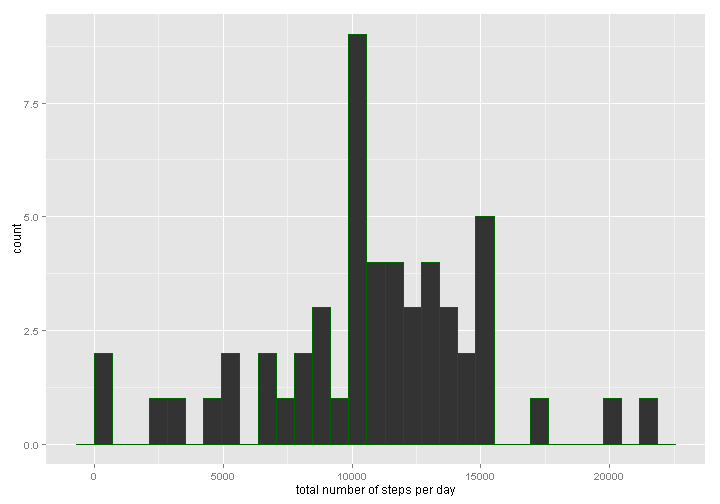
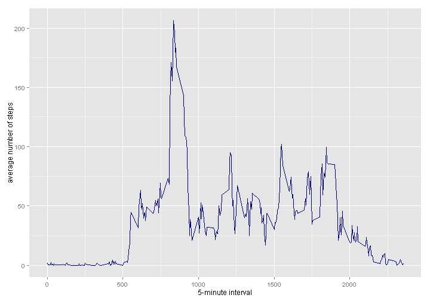
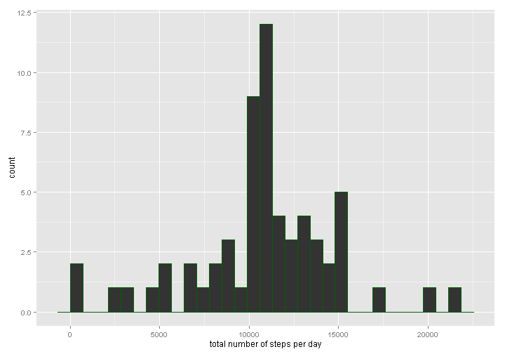
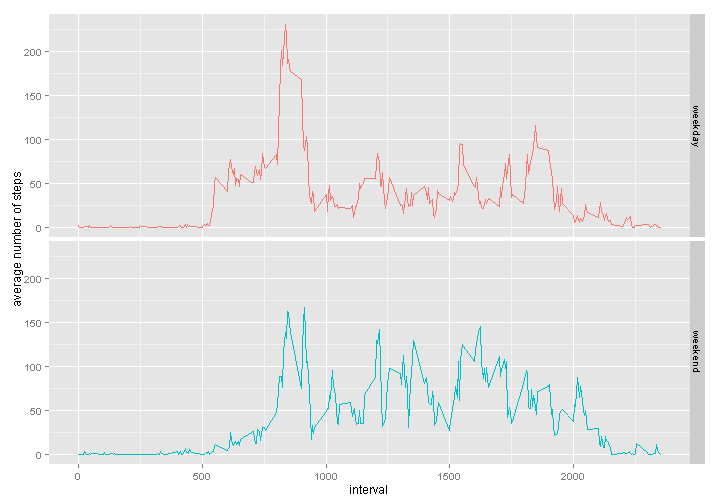

The following analysis makes use of data from a personal activity monitoring device. The data are collected from an anonymous individual during the months of October and November 2012.  
The data include the number of steps taken in 5 minute intervals each day.  
### Loading and preprocessing the data
First of all we download the R packages **dplyr** and **ggplot2**.  

```r
opts_chunk$set("fig.width = 10")
library(dplyr)
library(ggplot2)
Sys.setlocale("LC_TIME", "English_United States.1252")
```

```
## [1] "English_United States.1252"
```
We read the data from the file named `activity.csv` and we do some preprocessing operations. We will ignore the missing values (coded as `NA`) in the first part of our analysis.   

```r
actdata <- read.csv("./activity.csv")
actdata <- tbl_df(actdata)
actTbl <- actdata[!is.na(actdata$steps),]
dTbl <- group_by(actTbl, date)
```
### Mean total number of steps taken per day
We calculate the total number of steps taken per day and plot a histogram.

```r
steptot <- summarise(dTbl, total = sum(steps))
qplot(total, data = steptot, geom = "histogram") + geom_histogram(color="darkgreen") + xlab("total number of steps per day")
```

 
  
Then we determine the mean and median of the total number of steps taken per day:

```r
mean(steptot$total)
```

```
## [1] 10766.19
```

```r
median(steptot$total)
```

```
## [1] 10765
```
### Average daily activity pattern
We make a time series plot showing the 5-minute interval (x-axis) and the average number of steps taken, averaged across all days (y-axis). Then we determine which 5-minute interval contains the maximum number of steps.

```r
iTbl <- group_by(actTbl, interval)
stepavg <- summarise(iTbl, avg = mean(steps))
qplot(interval, avg, data = stepavg, geom = "line") + geom_line(color = "navy") + labs(x="5-minute interval", y="average number of steps")
```

 

```r
m <- max(stepavg$avg)
print(stepavg[stepavg$avg == m,])
```

```
## Source: local data frame [1 x 2]
## 
##   interval      avg
## 1      835 206.1698
```
### Imputing missing values
We calculate the number of missing values

```r
k <- sum(is.na(actdata$steps))
print(k)
```

```
## [1] 2304
```
Our strategy is to replace a missing value with the mean of the steps taken in the corresponding 5-minute interval.  

```r
naTbl <- actdata[is.na(actdata$steps),]
app <- right_join(stepavg, naTbl, by = "interval")
app$steps <- round(app$avg)
app <- select(app, steps, date, interval)
```
We create a new dataset with the missing data filled in:

```r
filledTbl <- bind_rows(actTbl, app)
filledTbl <- arrange(filledTbl, date, interval)
```
We create a new histogram showing the total number of steps taken per day:  

```r
fTbl <- group_by(filledTbl, date)
fTbl <- summarise(fTbl, total = sum(steps))
qplot(total, data = fTbl, geom = "histogram") + geom_histogram(color="darkgreen") + xlab("total number of steps per day")
```

 
  
and calculate the new mean and median of the total daily number of steps:  

```r
mean(fTbl$total)
```

```
## [1] 10765.64
```

```r
median(fTbl$total)
```

```
## [1] 10762
```
We observe that they differ very little from the values calculated before replacing missing values.  

### Weekday and weekend activity pattern analysis
Finally we want to examine if there are differences in activity patterns between weekdays and weekends.  

```r
filledTbl <- mutate(filledTbl, wday = weekdays(as.Date(date), abbreviate = TRUE))
filledTbl$wday[filledTbl$wday == "Sun"] <- "weekend"
filledTbl$wday[filledTbl$wday == "Sat"] <- "weekend"
filledTbl$wday[filledTbl$wday != "weekend"] <- "weekday"
filledTbl$wday <- as.factor(filledTbl$wday)
wTbl <- group_by(filledTbl, wday, interval)
wTbl <- summarise(wTbl, avg = mean(steps))
p <- qplot(interval, avg, col = wday, data = wTbl, geom = "line") + ylab("average number of steps")
p <- p + facet_grid(wday ~ .) + guides(color = "none")
print(p)
```

 
  
The panel plot above shows a sensible difference in the activity patterns:  
* in the __weekdays__ there is a larger number of steps during the early morning period (from 6:00 am to 10:00 am);
* in the __weekends__ the distribution of steps appears to be more uniform during the time intervals of the day (from 8:00 am to 8:00 pm).  


